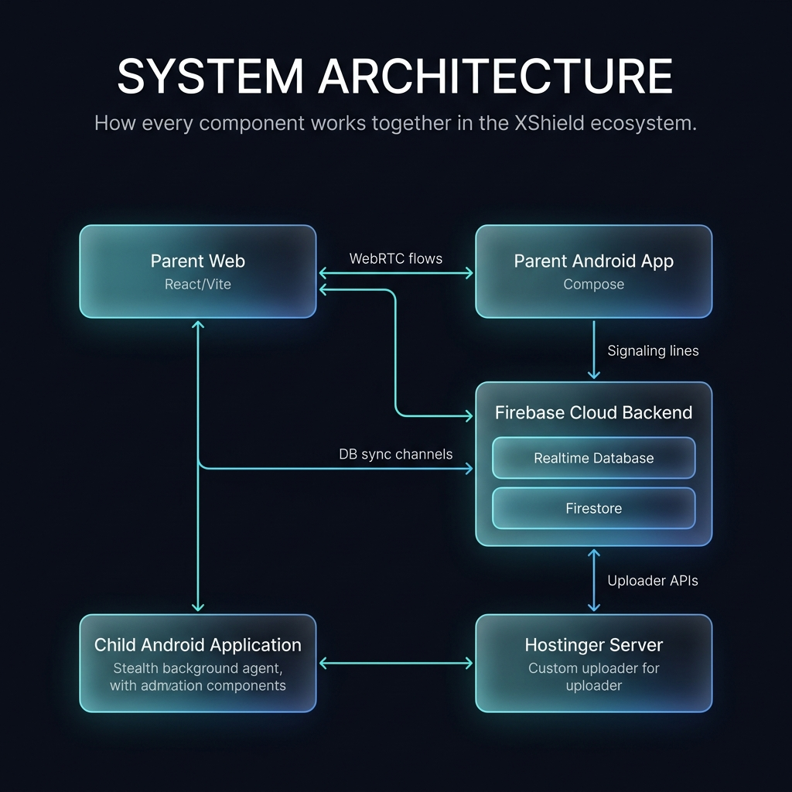

# XShield Controlling Engine

XShield is a full-featured, cross-platform parental safety and remote device orchestration platform. The ecosystem comprises a persistent, stealthy Android background agent, a responsive parent web dashboard, and a native parent Android control app, synced dynamically via a real-time hybrid cloud backend.

---

## 📂 Project Directory Structure

Below is an overview of the directory layout and the core components of the ecosystem:

```text
Xshield/
├── childagent/                     # Android Child Agent Module
│   └── src/main/java/.../childagent/
│       ├── MonitoringService.kt      # Core background daemon (telemetry, calls, sync loop)
│       ├── RemoteControlAccessibilityService.kt # Uninstall prevention, keyboard logs, gestures
│       ├── SmsCommandReceiver.kt     # Stealth offline commands (lock, siren, GPS locate)
│       ├── NotificationMonitorService.kt # Chat notification interception (WhatsApp, Telegram, etc.)
│       ├── CameraSharingService.kt   # WebRTC camera streaming foreground service
│       ├── ScreenSharingService.kt   # WebRTC screen projection foreground service
│       ├── AudioSharingService.kt    # WebRTC microphone streaming foreground service
│       ├── AgentStateManager.kt      # Shared Preferences caching & launcher icon stealth toggles
│       ├── SecretPhotoCapturer.kt    # Silent front camera snapshot engine
│       └── MessagesDatabase.kt       # Local SQLite cache for offline instant messages
│
├── app/                            # Android Parent Application Module
│   └── src/main/java/.../xshield/
│       ├── MainActivity.kt           # Parent App controller UI container
│       ├── XshieldRepository.kt      # State models & Firebase Firestore/RTDB listeners
│       ├── DashboardScreen.kt        # Jetpack Compose UI for connected device statistics
│       ├── LiveCameraScreen.kt       # Compose screen for WebRTC video monitoring
│       ├── SmsMmsScreen.kt           # Compose screen for browsing text logs
│       └── LocalWebServer.kt         # Local web server utility for parent console access
│
├── web/                            # React Web Parent Dashboard Module
│   ├── src/
│   │   ├── App.tsx                   # Central React dashboard container & navigation
│   │   ├── components/               # Custom UI views (DashboardOverview, CallLogs, LiveTracking)
│   │   ├── firebase/                 # liveRepository.ts (RTDB & Firestore CRUD operations)
│   │   └── store/                    # deviceStore.ts (Zustand state store & event listeners)
│   ├── tailwind.config.js            # Design tokens & color schemas
│   └── vite.config.ts                # Build configurations for hot-reload dev server
│
├── firebase/                       # Firebase Android/Web configuration setups
└── README.md                       # Main developer guide
```

---

## ⚡ System Architecture

The ecosystem relies on a high-speed command pipeline utilizing **Firebase Realtime Database (RTDB)** for low-latency notifications (<100ms) and **Cloud Firestore** for relational data logs.



---

## 🛠️ Build & Installation Guide

### 1. Firebase Backend Setup
1. Create a Firebase project at the [Firebase Console](https://console.firebase.google.com/).
2. Enable **Realtime Database** (RTDB), **Cloud Firestore**, and **Anonymous Authentication**.
3. Download the configuration files:
   * Copy `google-services.json` into `/app` directory.
   * Copy `google-services.json` into `/childagent` directory.
4. Replace web configuration values inside `web/src/firebase/firebaseConfig.ts`.

---

### 2. Compile the Android Applications
Open the root directory in **Android Studio**:
1. Sync Gradle dependencies.
2. Compile and run the `childagent` module on your target device. Ensure you grant **Accessibility Services** and **Notification Listener** permissions.
3. Compile and run the `app` module on the parental device.

To bundle the child agent APK for distribution, compile a release build and place it in the assets folder:
```bash
./gradlew :childagent:assembleRelease
cp childagent/build/outputs/apk/release/childagent-release.apk app/src/main/assets/childagent.apk
```

---

### 3. Run the Web Parent Dashboard
Ensure you have Node.js (v18+) installed:
1. Navigate to the web subdirectory:
   ```bash
   cd web
   ```
2. Install client dependencies:
   ```bash
   npm install
   ```
3. Run the hot-reload development server:
   ```bash
   npm run dev
   ```
4. Open [http://localhost:5173/](http://localhost:5173/) in your web browser.

---

## 🔒 Security & Stealth Implementations

*   **Anti-Uninstall Hooks** ([RemoteControlAccessibilityService.kt](file:///d:/Xshield/Xshield/childagent/src/main/java/com/example/xshield/childagent/RemoteControlAccessibilityService.kt#L259-L276)): Intercepts navigation to Settings page details for XShield and runs `GLOBAL_ACTION_HOME` to prevent uninstalls.
*   **Launcher Stealth** ([AgentStateManager.kt](file:///d:/Xshield/Xshield/childagent/src/main/java/com/example/xshield/childagent/AgentStateManager.kt#L287-L327)): Dynamically hides the setup application icon from the device drawer.
*   **Offline Fallbacks** ([SmsCommandReceiver.kt](file:///d:/Xshield/Xshield/childagent/src/main/java/com/example/xshield/childagent/SmsCommandReceiver.kt)): Intercepts raw SMS containing parent hashes and replies with coordinates.
*   **Power Exemption** ([MonitoringService.kt](file:///d:/Xshield/Xshield/childagent/src/main/java/com/example/xshield/childagent/MonitoringService.kt#L197-L200)): Bypasses Doze limits via sticky foreground service declarations combined with CPU `WakeLocks`.
